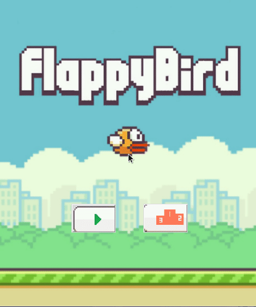

<br />
<p align="center">
    
  <h3 align="center">Flappy Bird</h3>
  <p align="center">
    Using only the standard python libary
  </p>
  <br />
</p>

## About The Project



A very simple recreation of flappy bird using only the standard python library (no pygame). This project uses tkinter for its GUI and turtle for the graphics.


## Getting Started

1. Clone the repo
   ```sh
   git clone https://github.com/ayshmnmm/flappy-bird.git
   ```
   or download zip and extract

2. Run `main.py` in the `src` directory
   ```sh
   python main.py
   ```


## Contributing

Pull requests are always welcome. Any contributions you make are **greatly appreciated**.


## License

Distributed under the [MIT License](LICENSE).
